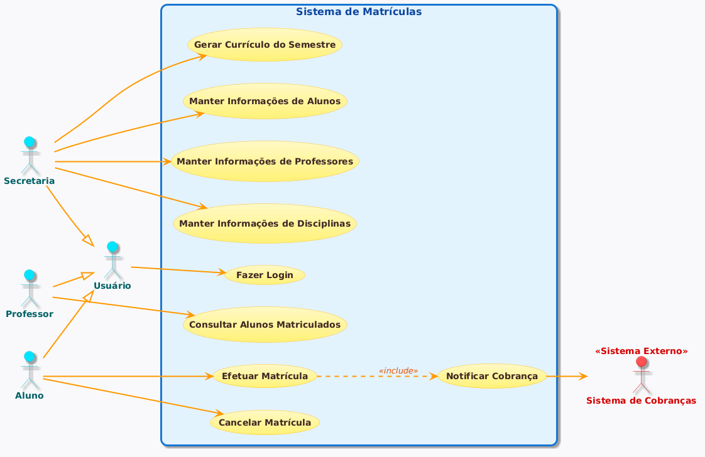

# Sistema de Matrículas - Laboratório 1

Este repositório contém os artefatos gerados para a Sprint 01 do projeto do Sistema de Matrículas da universidade.

**Integrantes:** Fabrício Rocha Lopes, Gabriel Silva Neiva Amaro, Otávio Chaves Silva, Samuel Rocha Ferraz Gonçalves Rebula

## Diagrama de Caso de Uso

Abaixo está a representação visual dos atores e suas interações com o sistema:

---

## Histórias de Usuário

Este documento descreve as histórias de usuário referentes ao escopo do Sistema de Matrículas da universidade.

### US01 - Login de Usuários
**Como** um usuário do sistema (Aluno, Professor ou funcionário da Secretaria),
**Eu quero** acessar o sistema validando meu login com uma senha,
**Para que** eu possa utilizar as funcionalidades do meu perfil com segurança.

### US02 - Manter Cadastros Básicos
**Como** funcionário da secretaria,
**Eu quero** manter as informações sobre as disciplinas, professores e alunos,
**Para que** o banco de dados da universidade esteja sempre atualizado.

### US03 - Gerar Currículo do Semestre
**Como** funcionário da secretaria,
**Eu quero** gerar o currículo para cada semestre,
**Para que** os alunos saibam quais disciplinas estarão disponíveis para matrícula.

### US04 - Efetuar Matrícula em Disciplinas
**Como** aluno,
**Eu quero** acessar o sistema durante o período de matrículas para me inscrever em até 4 disciplinas obrigatórias e 2 optativas,
**Para que** eu possa cursar o semestre vigente.

### US05 - Cancelar Matrícula
**Como** aluno,
**Eu quero** acessar o sistema durante o período de matrículas para cancelar matrículas feitas anteriormente,
**Para que** eu possa ajustar minha grade de horários.

### US06 - Gerenciar Quórum e Vagas (Regras de Negócio Automáticas)
**Como** sistema de matrículas,
**Eu quero** encerrar inscrições ao atingir 60 alunos e cancelar disciplinas com menos de 3 alunos ao fim do período de matrículas,
**Para que** as regras da universidade para a viabilidade das turmas sejam respeitadas.

### US07 - Notificação de Cobrança
**Como** sistema de matrículas,
**Eu quero** notificar o sistema de cobranças após a inscrição de um aluno,
**Para que** o aluno possa ser cobrado pelas disciplinas daquele semestre.

### US08 - Consultar Alunos da Disciplina
**Como** professor,
**Eu quero** acessar o sistema para saber quais são os alunos matriculados em cada disciplina,
**Para que** eu possa planejar minhas aulas e acompanhar a turma.