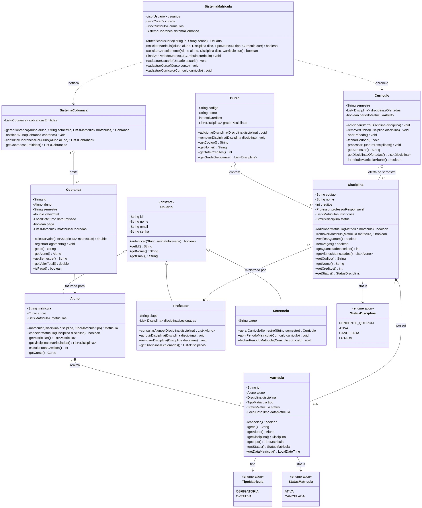
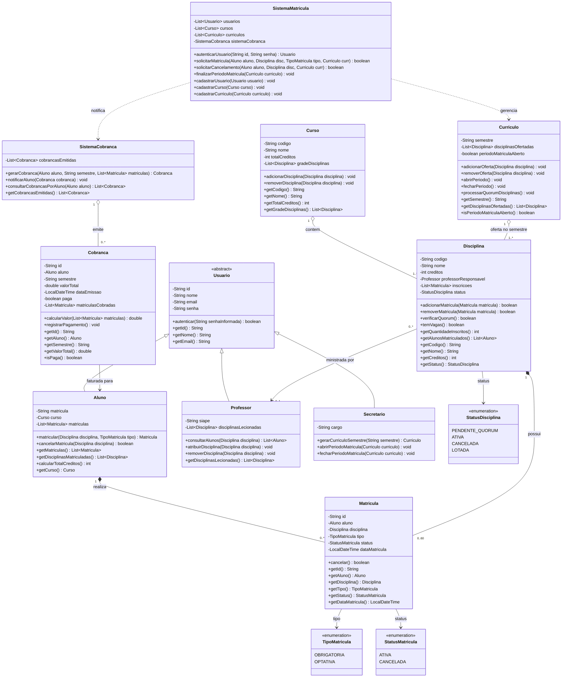

# Sistema de Matrículas - Laboratório 1

Este repositório contém os artefatos gerados para a Sprint 01 do projeto do Sistema de Matrículas da universidade.

**Integrantes:** Fabrício Rocha Lopes, Gabriel Silva Neiva Amaro, Otávio Chaves Silva, Samuel Rocha Ferraz Gonçalves Rebula

## Diagrama de Caso de Uso

Abaixo está a representação visual dos atores e suas interações com o sistema:


---

## Histórias de Usuário

Este documento descreve as histórias de usuário referentes ao escopo do Sistema de Matrículas da universidade.

### US01 - Login de Usuários
**Como** um usuário do sistema (Aluno, Professor ou funcionário da Secretaria),
**Eu quero** acessar o sistema validando meu login com uma senha,
**Para que** eu possa utilizar as funcionalidades do meu perfil com segurança.

### US02 - Manter Cadastros Básicos
**Como** funcionário da secretaria,
**Eu quero** manter as informações sobre as disciplinas, professores e alunos,
**Para que** o banco de dados da universidade esteja sempre atualizado.

### US03 - Gerar Currículo do Semestre
**Como** funcionário da secretaria,
**Eu quero** gerar o currículo para cada semestre,
**Para que** os alunos saibam quais disciplinas estarão disponíveis para matrícula.

### US04 - Efetuar Matrícula em Disciplinas
**Como** aluno,
**Eu quero** acessar o sistema durante o período de matrículas para me inscrever em até 4 disciplinas obrigatórias e 2 optativas,
**Para que** eu possa cursar o semestre vigente.

### US05 - Cancelar Matrícula
**Como** aluno,
**Eu quero** acessar o sistema durante o período de matrículas para cancelar matrículas feitas anteriormente,
**Para que** eu possa ajustar minha grade de horários.

### US06 - Gerenciar Quórum e Vagas (Regras de Negócio Automáticas)
**Como** sistema de matrículas,
**Eu quero** encerrar inscrições ao atingir 60 alunos e cancelar disciplinas com menos de 3 alunos ao fim do período de matrículas,
**Para que** as regras da universidade para a viabilidade das turmas sejam respeitadas.

### US07 - Notificação de Cobrança
**Como** sistema de matrículas,
**Eu quero** notificar o sistema de cobranças após a inscrição de um aluno,
**Para que** o aluno possa ser cobrado pelas disciplinas daquele semestre.

### US08 - Consultar Alunos da Disciplina
**Como** professor,
**Eu quero** acessar o sistema para saber quais são os alunos matriculados em cada disciplina,
**Para que** eu possa planejar minhas aulas e acompanhar a turma.

---

## Sprint 02 (Lab01S02) - Projeto Estrutural e Projeto Java

Nesta sprint foram desenvolvidos o **Diagrama de Classes UML** detalhado do sistema e a criação do **Projeto Java** contendo todas as classes, atributos, enums, relacionamentos e stubs dos métodos modelados.

### Diagrama de Classes UML

Abaixo está a representação visual estrutural das classes, atributos, métodos e associações:



#### Representação em Mermaid



---

### Mapeamento das Regras de Negócio e Decisões de Projeto

| Regra de Negócio / Requisito | Entidades e Métodos Responsáveis | Descrição da Implementação |
| :--- | :--- | :--- |
| **Login e Autenticação** | `Usuario`, `SistemaMatricula.autenticarUsuario()` | Herança comum de `Usuario` permitindo autenticação polimórfica para Aluno, Professor e Secretaria. |
| **Limite de Matrículas (4 obrigatórias + 2 optativas)** | `Aluno.matricular()`, `TipoMatricula` | Validação estrita: impede ultrapassar 4 disciplinas obrigatórias e 2 optativas. |
| **Cancelamento de Matrícula** | `Aluno.cancelarMatricula()`, `Matricula.cancelar()` | Permite desativar a matrícula dentro do período, liberando a vaga na disciplina. |
| **Quórum Mínimo (3 alunos)** | `Disciplina.verificarQuorum()`, `Curriculo.fecharPeriodo()` | Ao fechar o período de matrículas, disciplinas com menos de 3 inscritos ativos mudam o status para `CANCELADA`. |
| **Limite Máximo de Vagas (60 alunos)** | `Disciplina.adicionarMatricula()`, `Disciplina.temVagas()` | Limita em 60 inscrições por disciplina; novas matrículas são rejeitadas e status vai para `LOTADA`. |
| **Integração com Cobrança** | `SistemaCobranca`, `Cobranca` | Notificado automaticamente a cada matrícula confirmada, calculando o valor por créditos cursados e gerando fatura. |
| **Consulta de Alunos pelo Professor** | `Professor.consultarAlunos()` | Permite que o docente consulte a lista nominal de alunos matriculados em suas turmas. |
| **Gestão do Currículo Semestral** | `Secretario.gerarCurriculoSemestre()`, `Curriculo` | Agrupa disciplinas ofertadas e controla o estado aberto/fechado do período de matrículas. |

---

### Estrutura do Projeto Java

O projeto foi gerado com **Maven** nativo configurado para **Java 21**, seguindo a arquitetura em camadas e boas práticas de Orientação a Objetos:

```
sistemas-de-matricula-lds2/
├── pom.xml
├── README.md
├── img/
│   ├── casos-de-uso.png
│   └── diagrama-de-classes.png
└── src/
    ├── main/
    │   └── java/
    │       └── br/
    │           └── edu/
    │               └── pucminas/
    │                   └── matricula/
    │                       ├── App.java
    │                       ├── enums/
    │                       │   ├── StatusDisciplina.java
    │                       │   ├── StatusMatricula.java
    │                       │   └── TipoMatricula.java
    │                       ├── model/
    │                       │   ├── Aluno.java
    │                       │   ├── Cobranca.java
    │                       │   ├── Curriculo.java
    │                       │   ├── Curso.java
    │                       │   ├── Disciplina.java
    │                       │   ├── Matricula.java
    │                       │   ├── Professor.java
    │                       │   ├── Secretario.java
    │                       │   └── Usuario.java
    │                       └── service/
    │                           ├── SistemaCobranca.java
    │                           └── SistemaMatricula.java
    └── test/
        └── java/
            └── br/
                └── edu/
                    └── pucminas/
                        └── matricula/
                            └── AppTest.java
```

---

### Como Compilar e Executar

#### 1. Compilar o Projeto
```bash
mvn clean compile
```

#### 2. Executar a Suíte de Testes Unitários (JUnit 5)
```bash
mvn test
```

#### 3. Executar o Protótipo de Demonstração
```bash
mvn exec:java
```
